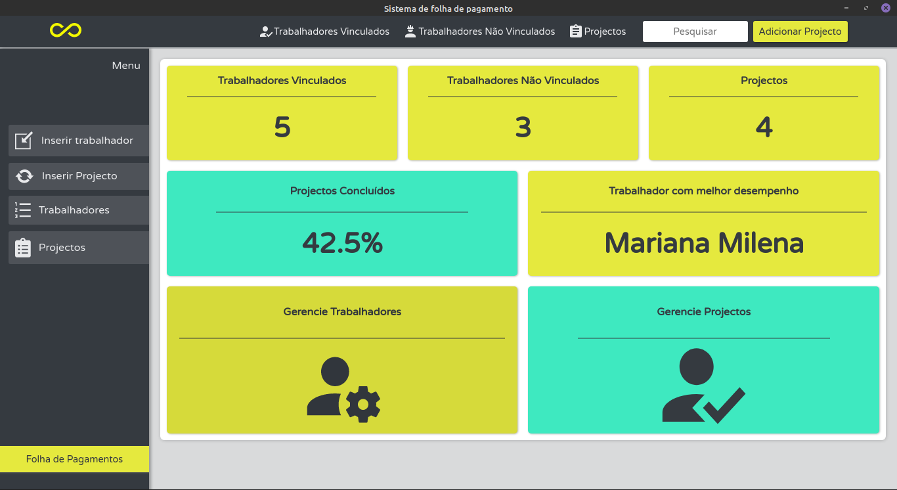

# Sistema de Folha de Pagamento

### Descrição

<p>A ideia é gerenciar as tarefas de cada trabalhador inserido em um determinado projecto e consoante algumas regras de negócio gerar o salário deste trabalhador!</p>

### Motivações
<p>As motivações para o uso deste sistema seriam o melhor controlo do desempenho dos trabalhadores, manter a organização da coorporação, facilitar no cálculo salarial dos funcionários e muito mais.</p>


### Funcionalidades
<p> O sistema permite o registo de vários funcionários. Os funcionários podem ser permanentes (Vinculados) e não permanentes (Não Vinculados). Dentre os dados registados  é possível guardar até as fotos de um determinado funcionário. O sistema permite a criação de projectos, e cada funcionário está associado a um determinado projecto.
Cada funcionário tem uma quantidade de tarefas a cumprir em um determinado projecto e o sistema permite registar o também o número de tarefas já cumpridas.
</p>
<p> Cada projecto tem o seu índice de conclusão e este pode ser alterado manualmente pelo gerenciador do sistema.
O sistema pode ainda, calcular a folha de salário dos funcionários e o valor total a ser gasto para pagamentos de salários.
</p>

### Instalação

 + 1º passo: faça o download do projecto para sua máquina local. poderá usar o comando

      ```git
       git clone https://github.com/Seratooo/S-folha-de-pagamento.git
     ```
 + 2º passo: faça a instalação das dependências deste projecto.
      - entre na pasta server e pasta web respectivamente e digite o camando `yarn` (em ambas pastas).

  + 3º passo: Agora é só rodar o projecto. Comece por entrar na pastar server e digitar o   comando `yarn dev`. Assim o seu backend entrará em acção. Entre agora na pasta web e digite o camando `yarn start` para rodar o frontend e prontos!!!. Após estes passos, vc também poderá rodar na versão desktop entrando na pasta web e digitar o comando `yarn electron`.



